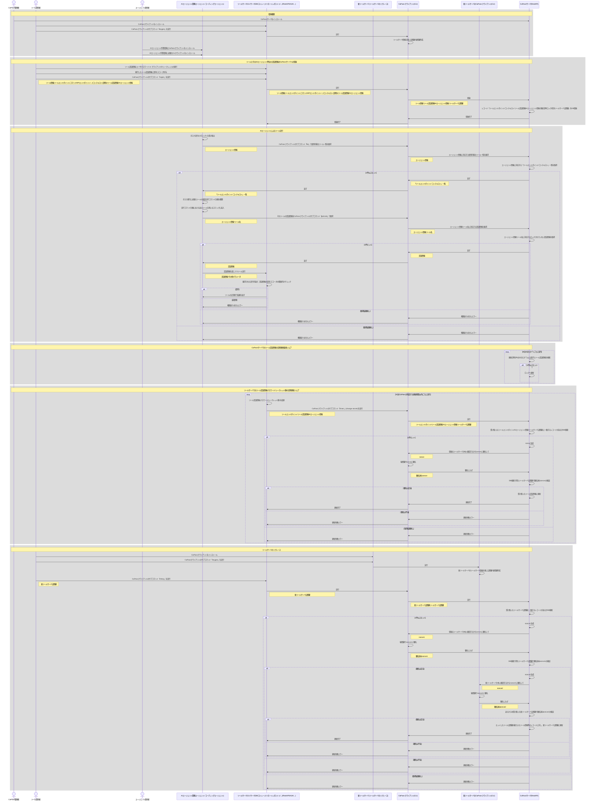

```mermaid
sequenceDiagram
    actor capass_provider as CaPass管理者
    actor tool_provider as ツール提供者
    actor agent_provider as エージェント提供者
    participant agent as AIエージェント(業務エージェント/コーディングエージェント)
    participant tool_server as ツールサーバ(CLIサーバ(DB/ストレージ/リモートレポジトリ/...)/RestAPI/A2A/...)
    participant tool_server_new as 新ツールサーバ(ツールサーバのリプレース)
    participant capass_client as CaPassクライアント(CLI)
    participant capass_client_new as 新ツールサーバのCaPassクライアント(CLI)
    participant capass_server as CaPassサーバ(RestAPI)

    rect rgba(220, 220, 220, 1)
        Note over capass_provider,capass_server: 環境構築
        capass_provider ->> capass_server: CaPassサーバをインストール
        tool_provider ->> tool_server: CaPassクライアントをインストール
        tool_provider ->> tool_server: CaPassクライアントのサブコマンド「keygen」を実行
        tool_server ->> capass_client: 実行
        capass_client ->> capass_client: ツールサーバ情報を基に公開鍵/秘密鍵作成
        agent_provider ->> agent: AIエージェント作業環境にCaPassクライアントをインストール
        agent_provider ->> agent: AIエージェント作業環境に必要なCLIクライアントをインストール
    end
    rect rgba(220, 220, 220, 1)
        Note over capass_provider,capass_server: ツールとその(AIエージェント単位の)認証情報のCaPassサーバへの登録
        tool_provider ->> tool_server: ツール認証情報(ユーザ/パスワード or クライアントID/シークレット)の発行
        tool_provider ->> tool_server: 発行したツール認証情報に認可(スコープ)付与
        tool_provider ->> tool_server: CaPassクライアントのサブコマンド「regist」を実行
        Note right of tool_provider: ツール情報(ツールエンドポイント(コマンド/APIエンドポイント/...)/コンテキスト(説明))/ツール認証情報/AIエージェント情報
        tool_server ->> capass_client: 実行
        Note right of tool_server: ツール情報(ツールエンドポイント(コマンド/APIエンドポイント/...)/コンテキスト(説明))/ツール認証情報/AIエージェント情報
        capass_client ->> capass_server: 登録
        Note right of capass_client: ツール情報/ツール認証情報/AIエージェント情報/ツールサーバ公開鍵
        capass_server ->> capass_server: レコード「ツールエンドポイント/コンテキスト/ツール認証情報/AIエージェント情報/更新日時/ロック状況/ツールサーバ公開鍵」をDB登録
        capass_server ->> capass_client: 登録完了
        capass_client ->> tool_server: 登録完了
    end
    rect rgba(220, 220, 220, 1)
        Note over capass_provider,capass_server: AIエージェントによるツール実行
        agent ->> agent: タスク実行のプロンプトを受け取る
        agent ->> capass_client: CaPassクライアントのサブコマンド「list」で使用可能なツール一覧を要求
        Note right of agent: エージェント情報
        capass_client ->> capass_server: エージェント情報に対応する使用可能なツール一覧を要求
        Note right of capass_client: エージェント情報
        capass_server ->> capass_server: エージェント情報に対応する「ツールエンドポイント/コンテキスト」一覧を取得
        alt 1件以上ヒット
            capass_server ->> capass_client: 返す
            Note right of capass_client: 「ツールエンドポイント/コンテキスト」一覧
            capass_client ->> agent: 返す
            Note right of agent: 「ツールエンドポイント/コンテキスト」一覧
            agent ->> agent: タスク遂行に必要なツールの選定/実行コマンド計画を構築
            agent ->> agent: 実行コマンド計画におけるあるツールを用いるステップに突入
            agent ->> capass_client: そのツールの認証情報をCaPassクライアントのサブコマンド「getcred」で要求
            Note right of agent: エージェント情報/ツール名
            capass_client ->> capass_server: エージェント情報/ツール名に対応する認証情報を要求
            Note right of capass_client: エージェント情報/ツール名
            capass_server ->> capass_server: エージェント情報/ツール名に対応するロックされていない認証情報を取得
            alt 1件ヒット
                capass_server ->> capass_client: 返す
                Note right of capass_client: 認証情報
                capass_client ->> agent: 返す
                Note right of agent: 認証情報
                agent ->> tool_server: 認証情報を渡しつつツール実行
                Note right of agent: 認証情報/その他パラメータ
                tool_server ->> tool_server: 要求された実行内容が、認証情報の認可(スコープ)の範囲内かチェック
                alt 認可
                    tool_server ->> agent: ツールの正常終了結果を返す
                else 非認可
                    tool_server ->> agent: 権限ありませんエラー
                end
            else 取得結果無し
                capass_server ->> capass_client: 権限ありませんエラー
                capass_client ->> agent: 権限ありませんエラー
            end
        else 取得結果無し
            capass_server ->> capass_client: 権限ありませんエラー
            capass_client ->> agent: 権限ありませんエラー
        end
    end
    rect rgba(220, 220, 220, 1)
        Note over capass_provider,capass_server: CaPassサーバでのツール認証情報の定期更新監視ジョブ
        loop N分(5分とか？)ごとに実行
            capass_server ->> capass_server: 更新日時がN分(5分とか？)以上過ぎたツール認証情報を検索
            alt 1件以上ヒット
                capass_server ->> capass_server: ロックへ更新
            end
        end
    end
    rect rgba(220, 220, 220, 1)
        Note over capass_provider,capass_server: ツールサーバでのツール認証情報(パスワード/シークレット値)の定期更新ジョブ
        loop N分(CaPassが指定する更新期間以内)ごとに実行
            tool_server ->> tool_server: ツール認証情報(パスワード/シークレット値)を変更
            tool_server ->> capass_client: CaPassクライアントのサブコマンド「chsec」(change secret)を実行
            Note right of tool_server: ツールエンドポイント/ツール認証情報/AIエージェント情報
            capass_client ->> capass_server: 実行
            Note right of capass_client: ツールエンドポイント/ツール認証情報/AIエージェント情報/ツールサーバ公開鍵
            capass_server ->> capass_server: 受け取った[ツールエンドポイント/AIエージェント情報/ツールサーバ公開鍵]に一致するレコードがあるかDB検索
            alt 1件ヒット
                capass_server ->> capass_server: nonce生成
                capass_server ->> capass_client: 登録元ツールサーバか本人確認するからnonceに署名して
                Note right of capass_client: nonce
                capass_client ->> capass_client: 秘密鍵でnonceに署名
                capass_client ->> capass_server: 署名したぜ
                Note right of capass_client: 署名済みnonce
                capass_server ->> capass_server: DB検索で得たツールサーバ公開鍵で署名済みnonceの検証
                alt 署名は正当
                    capass_server ->> capass_server: 受け取ったツール認証情報に更新
                    capass_server ->> capass_client: 更新完了
                    capass_client ->> tool_server: 更新完了
                else 署名は不当
                    capass_server ->> capass_client: 更新失敗エラー
                    capass_client ->> tool_server: 更新失敗エラー
                end
            else 取得結果無し
                capass_server ->> capass_client: 更新失敗エラー
                capass_client ->> tool_server: 更新失敗エラー
            end
        end
    end
    rect rgba(220, 220, 220, 1)
        Note over capass_provider,capass_server: ツールサーバのリプレース
        tool_provider ->> tool_server_new: CaPassクライアントをインストール
        tool_provider ->> tool_server_new: CaPassクライアントのサブコマンド「keygen」を実行
        tool_server_new ->> capass_client_new: 実行
        capass_client_new ->> capass_client_new: 新ツールサーバのツールサーバ情報を基に公開鍵/秘密鍵作成
        tool_provider ->> tool_server: CaPassクライアントのサブコマンド「chkey」を実行
        Note right of tool_provider: 新ツールサーバ公開鍵
        tool_server ->> capass_client: 実行
        Note right of tool_server: 新ツールサーバ公開鍵
        capass_client ->> capass_server: 実行
        Note right of capass_client: 新ツールサーバ公開鍵/ツールサーバ公開鍵
        capass_server ->> capass_server: 受け取ったツールサーバ公開鍵に一致するレコードがあるかDB検索
        alt 1件以上ヒット
            capass_server ->> capass_server: nonce1生成
            capass_server ->> capass_client: 登録元ツールサーバか本人確認するからnonceに署名して
            Note right of capass_client: nonce1
            capass_client ->> capass_client: 秘密鍵でnonce1に署名
            capass_client ->> capass_server: 署名したぜ
            Note right of capass_client: 署名済みnonce1
            capass_server ->> capass_server: DB検索で得たツールサーバ公開鍵で署名済みnonce1の検証
            alt 署名は正当
                capass_server ->> capass_server: nonce2生成
                capass_server ->> capass_client_new: 新ツールサーバか本人確認するからnonce2に署名して
                Note right of capass_client_new: nonce2
                capass_client_new ->> capass_client_new: 秘密鍵でnonce2に署名
                capass_client_new ->> capass_server: 署名したぜ
                Note right of capass_client_new: 署名済みnonce2
                capass_server ->> capass_server: あらかじめ受け取った新ツールサーバ公開鍵で署名済みnonce2の検証
                alt 署名は正当
                    capass_server ->> capass_server: ヒットしたツール公開鍵が紐づいたツール情報等のレコードに対し、新ツールサーバ公開鍵に更新
                    capass_server ->> capass_client: 更新完了
                    capass_client ->> tool_server: 更新完了
                else 署名は不当
                    capass_server ->> capass_client: 更新失敗エラー
                    capass_client ->> tool_server: 更新失敗エラー
                end
            else 署名は不当
                capass_server ->> capass_client: 更新失敗エラー
                capass_client ->> tool_server: 更新失敗エラー
            end
        else 取得結果無し
            capass_server ->> capass_client: 更新失敗エラー
            capass_client ->> tool_server: 更新失敗エラー
        end
    end
```