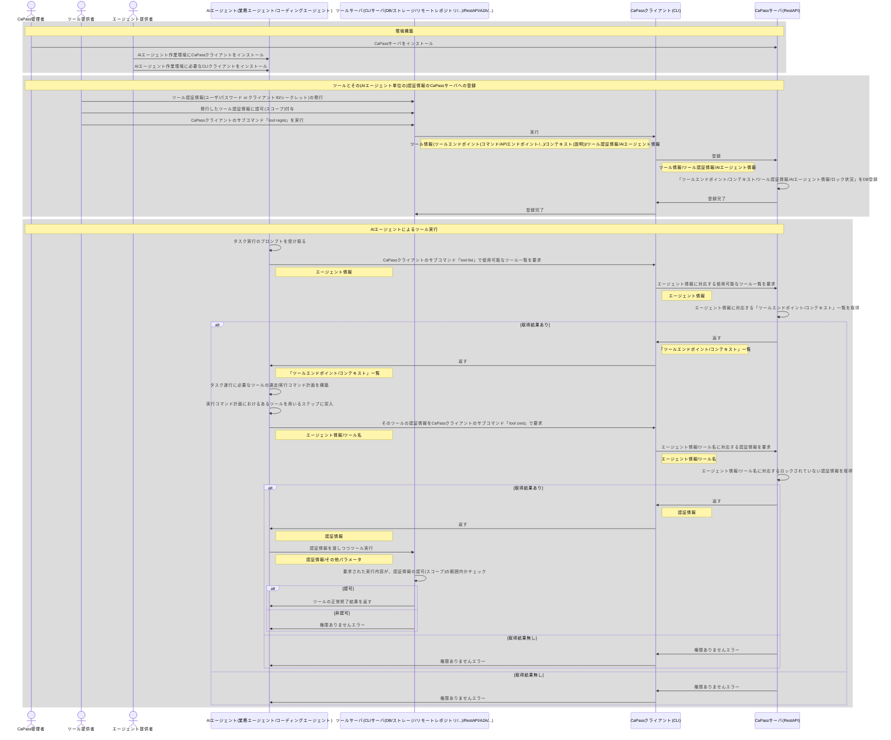

```mermaid
sequenceDiagram
    actor capass_provider as CaPass管理者
    actor tool_provider as ツール提供者
    actor agent_provider as エージェント提供者
    participant agent as AIエージェント(業務エージェント/コーディングエージェント)
    participant tool_server as ツールサーバ(CLIサーバ(DB/ストレージ/リモートレポジトリ/...)/RestAPI/A2A/...)
    participant capass_client as CaPassクライアント(CLI)
    participant capass_server as CaPassサーバ(RestAPI)

    rect rgba(220, 220, 220, 1)
        Note over capass_provider,capass_server: 環境構築
        capass_provider ->> capass_server: CaPassサーバをインストール
        agent_provider ->> agent: AIエージェント作業環境にCaPassクライアントをインストール
        agent_provider ->> agent: AIエージェント作業環境に必要なCLIクライアントをインストール
    end
    rect rgba(220, 220, 220, 1)
        Note over capass_provider,capass_server: ツールとその(AIエージェント単位の)認証情報のCaPassサーバへの登録
        tool_provider ->> tool_server: ツール認証情報(ユーザ/パスワード or クライアントID/シークレット)の発行
        tool_provider ->> tool_server: 発行したツール認証情報に認可(スコープ)付与
        tool_provider ->> tool_server: CaPassクライアントのサブコマンド「tool regist」を実行
        tool_server ->> capass_client: 実行
        Note right of tool_server: ツール情報(ツールエンドポイント(コマンド/APIエンドポイント/...)/コンテキスト(説明))/ツール認証情報/AIエージェント情報
        capass_client ->> capass_server: 登録
        Note right of capass_client: ツール情報/ツール認証情報/AIエージェント情報
        capass_server ->> capass_server: 「ツールエンドポイント/コンテキスト/ツール認証情報/AIエージェント情報/ロック状況」をDB登録
        capass_server ->> capass_client: 登録完了
        capass_client ->> tool_server: 登録完了
    end
    rect rgba(220, 220, 220, 1)
        Note over capass_provider,capass_server: AIエージェントによるツール実行
        agent ->> agent: タスク実行のプロンプトを受け取る
        agent ->> capass_client: CaPassクライアントのサブコマンド「tool list」で使用可能なツール一覧を要求
        Note right of agent: エージェント情報
        capass_client ->> capass_server: エージェント情報に対応する使用可能なツール一覧を要求
        Note right of capass_client: エージェント情報
        capass_server ->> capass_server: エージェント情報に対応する「ツールエンドポイント/コンテキスト」一覧を取得
        alt 取得結果あり
            capass_server ->> capass_client: 返す
            Note right of capass_client: 「ツールエンドポイント/コンテキスト」一覧
            capass_client ->> agent: 返す
            Note right of agent: 「ツールエンドポイント/コンテキスト」一覧
            agent ->> agent: タスク遂行に必要なツールの選定/実行コマンド計画を構築
            agent ->> agent: 実行コマンド計画におけるあるツールを用いるステップに突入
            agent ->> capass_client: そのツールの認証情報をCaPassクライアントのサブコマンド「tool cred」で要求
            Note right of agent: エージェント情報/ツール名
            capass_client ->> capass_server: エージェント情報/ツール名に対応する認証情報を要求
            Note right of capass_client: エージェント情報/ツール名
            capass_server ->> capass_server: エージェント情報/ツール名に対応するロックされていない認証情報を取得
            alt 取得結果あり
                capass_server ->> capass_client: 返す
                Note right of capass_client: 認証情報
                capass_client ->> agent: 返す
                Note right of agent: 認証情報
                agent ->> tool_server: 認証情報を渡しつつツール実行
                Note right of agent: 認証情報/その他パラメータ
                tool_server ->> tool_server: 要求された実行内容が、認証情報の認可(スコープ)の範囲内かチェック
                alt 認可
                    tool_server ->> agent: ツールの正常終了結果を返す
                else 非認可
                    tool_server ->> agent: 権限ありませんエラー
                end
            else 取得結果無し
                capass_server ->> capass_client: 権限ありませんエラー
                capass_client ->> agent: 権限ありませんエラー
            end
        else 取得結果無し
            capass_server ->> capass_client: 権限ありませんエラー
            capass_client ->> agent: 権限ありませんエラー
        end
    end
```