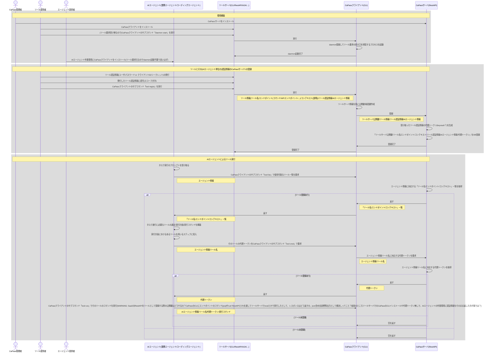

```mermaid
sequenceDiagram
    actor capass_provider as CaPass管理者
    actor tool_provider as ツール提供者
    actor agent_provider as エージェント提供者
    participant agent as AIエージェント(業務エージェント/コーディングエージェント)
    participant tool_server as ツールサーバ(CLI/RestAPI/A2A/...)
    participant capass_client as CaPassクライアント(CLI)
    participant capass_server as CaPassサーバ(RestAPI)

    rect rgba(220, 220, 220, 1)
        Note over capass_provider,capass_server: 環境構築
        capass_provider ->> capass_server: CaPassサーバをインストール
        tool_provider ->> tool_server: CaPassクライアントをインストール
        tool_provider ->> tool_server: (ツール要求受け側なので)CaPassクライアントのサブコマンド「daemon start」を実行
        tool_server ->> capass_client: 実行
        capass_client ->> capass_client: daemon登録してツール要求の受け口を常駐するプロセスを起動
        capass_client ->> tool_server: daemon起動完了
        agent_provider ->> agent: AIエージェント作業環境にCaPassクライアントをインストール(ツール要求元なのでdaemon起動不要で良いはず)
    end
    rect rgba(220, 220, 220, 1)
        Note over capass_provider,capass_server: ツールとその(AIエージェント単位の)認証情報のCaPassサーバへの登録
        tool_provider ->> tool_server: ツール認証情報(ユーザ/パスワード or クライアントID/シークレット)の発行
        tool_provider ->> tool_server: 発行したツール認証情報に認可(スコープ)付与
        tool_provider ->> tool_server: CaPassクライアントのサブコマンド「tool regist」を実行
        tool_server ->> capass_client: 実行
        Note right of tool_server: ツール情報(ツール名/エンドポイント(コマンド/APIエンドポイント/...)/コンテキスト(説明))/ツール認証情報/AIエージェント情報
        capass_client ->> capass_client: ツールサーバ情報を基に公開鍵/秘密鍵作成
        capass_client ->> capass_server: 登録
        Note right of capass_client: ツールサーバ公開鍵/ツール情報/ツール認証情報/AIエージェント情報
        capass_server ->> capass_server: 受け取ったツール認証情報の代理トークン(keyvault？)を生成
        capass_server ->> capass_server: 「ツールサーバ公開鍵/ツール名/エンドポイント/コンテキスト/ツール認証情報/AIエージェント情報/代理トークン」をDB登録
        capass_server ->> capass_client: 登録完了
        capass_client ->> tool_server: 登録完了
    end
    rect rgba(220, 220, 220, 1)
        Note over capass_provider,capass_server: AIエージェントによるツール実行
        agent ->> agent: タスク実行のプロンプトを受け取る
        agent ->> capass_client: CaPassクライアントのサブコマンド「tool list」で使用可能なツール一覧を要求
        Note right of agent: エージェント情報
        capass_server ->> capass_server: エージェント情報に対応する「ツール名/エンドポイント/コンテキスト」一覧を取得
        alt ツール登録あり
            capass_server ->> capass_client: 返す
            Note right of capass_client: 「ツール名/エンドポイント/コンテキスト」一覧
            capass_client ->> agent: 返す
            Note right of agent: 「ツール名/エンドポイント/コンテキスト」一覧
            agent ->> agent: タスク遂行に必要なツールの選定/実行計画/実行コマンドを構築
            agent ->> agent: 実行計画におけるあるツールを用いるステップに突入
            agent ->> capass_client: そのツールの代理トークンをCaPassクライアントのサブコマンド「tool cred」で要求
            Note right of agent: エージェント情報/ツール名
            capass_client ->> capass_server: エージェント情報/ツール名に対応する代理トークンを要求
            Note right of capass_client: エージェント情報/ツール名
            capass_server ->> capass_server: エージェント情報/ツール名に対応する代理トークンを取得
            alt ツール登録あり
                capass_server ->> capass_client: 返す
                Note right of capass_client: 代理トークン
                capass_client ->> agent: 返す
                Note right of agent: 代理トークン
                agent ->> capass_client: CaPassクライアントのサブコマンド「tool run」でそのツールのコマンドを実行[WARNING: SaaSのRestAPIをツールとして登録する際の公開鍵はどうやるの？CaPassのCLIにエンドポイントのコマンド(psqlやcurl RestAPIとか)を渡してツールサーバでevalとかで実行したとして、レスポンスはどう返すの、json含め全部標準出力として横流しってこと？結局のところツールサーバでのCaPassのCLIインストールや代理トークン無しで、AIエージェントの作業環境に認証情報をそのまま返した方が楽では？]
                Note right of agent: AIエージェント情報/ツール名/代理トークン/実行コマンド
            else ツール未登録
                capass_server ->> capass_client: 空を返す
            end
        else ツール未登録
            capass_server ->> capass_client: 空を返す
        end
    end
```